# InstaSHAP — Architecture, Problem Statement, Trade-offs & Use Cases

---

## 1. The Problem InstaSHAP Solves

### 1.1 The Core Challenge: Explainability Is Too Slow

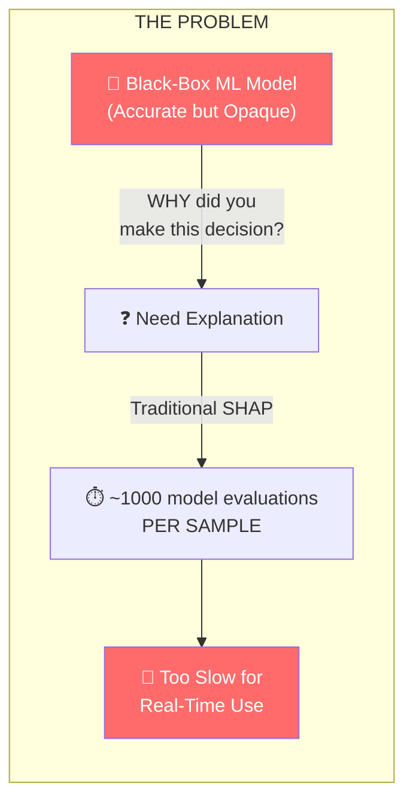

**In simple terms:** Modern ML models (deep neural networks, random forests) are powerful predictors, but they are "black boxes" — no one knows *why* they make specific decisions. **Shapley values** are the gold standard for explaining predictions, but computing them requires evaluating the model on **all possible feature subsets** — an exponentially expensive process.

| Scenario | Traditional SHAP | InstaSHAP |
|----------|-----------------|-----------|
| Explain 1 prediction | ~2-10 seconds | ~1-5 milliseconds |
| Explain 1000 predictions | ~30-60 minutes | < 5 seconds |
| Real-time dashboard | ❌ Impossible | ✅ Feasible |
| Regulatory audit (millions of records) | ❌ Days/weeks | ✅ Minutes |

### 1.2 Why This Matters

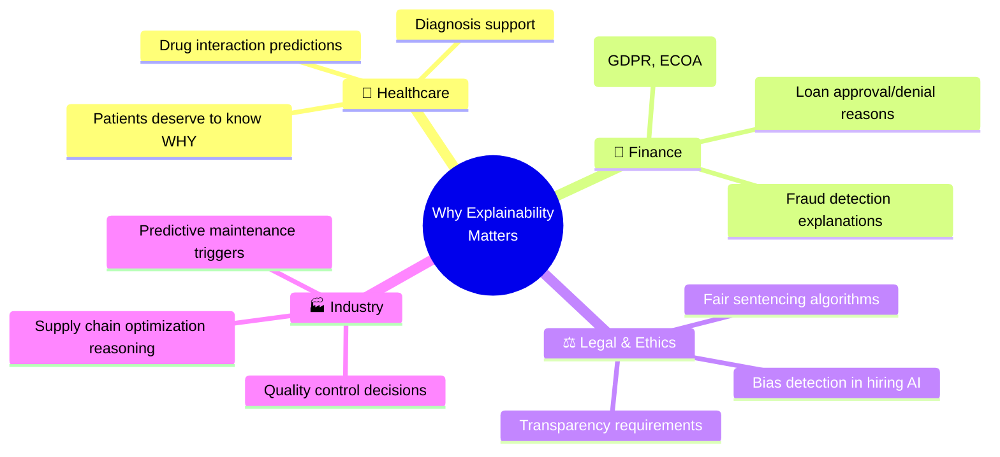

### 1.3 The Problem in One Sentence

> **Traditional SHAP gives perfect explanations but is too slow for production; InstaSHAP gives near-perfect explanations instantly by training an additive model that naturally recovers Shapley values in a single forward pass.**

---

## 2. System Architecture (Visual)

### 2.1 High-Level Pipeline

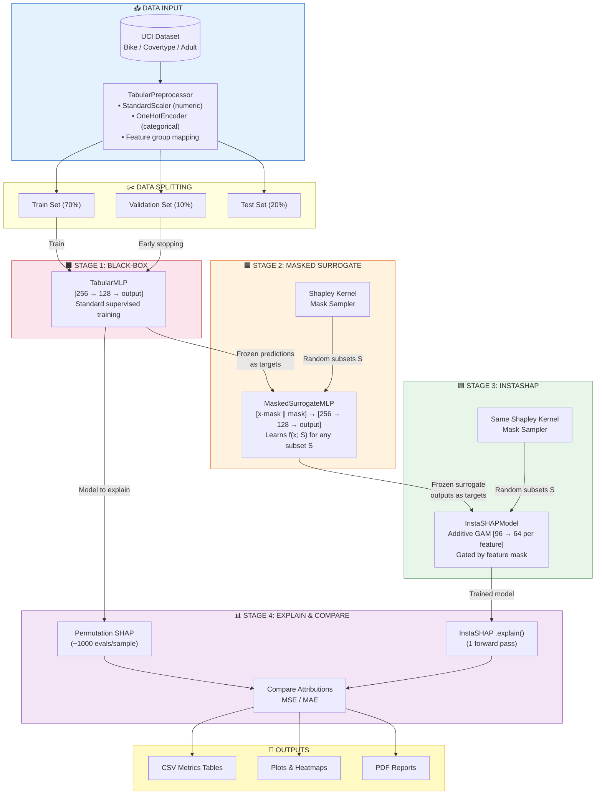

### 2.2 Model Architecture Details

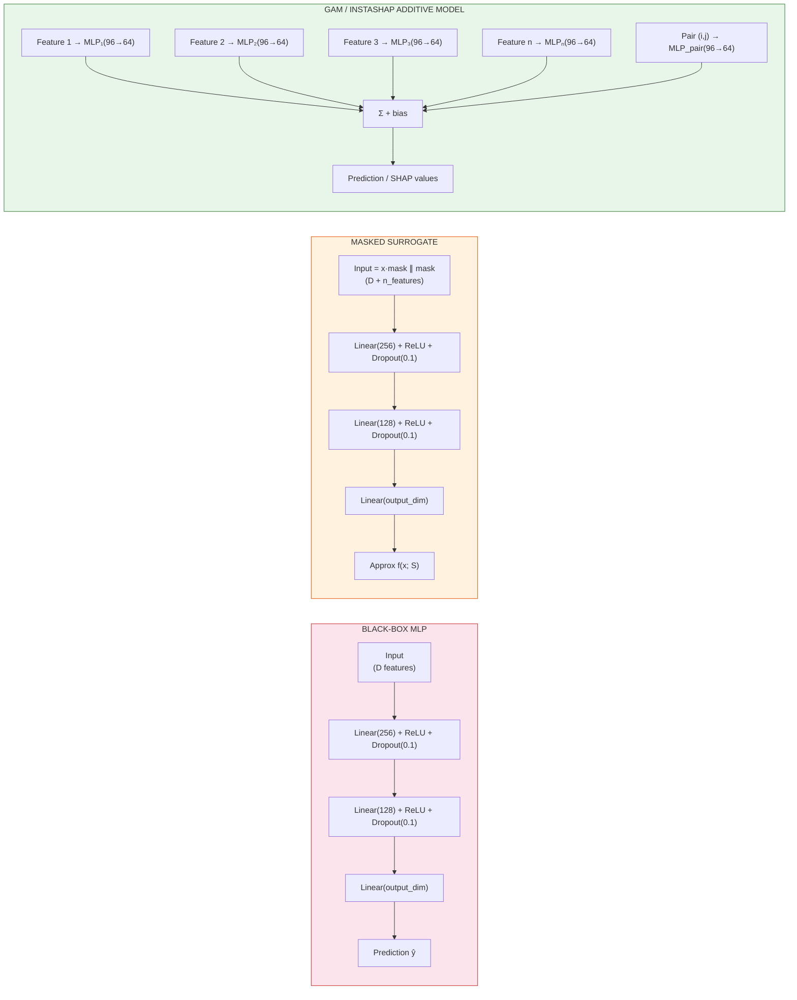

### 2.3 The Masking Mechanism (Core Innovation)

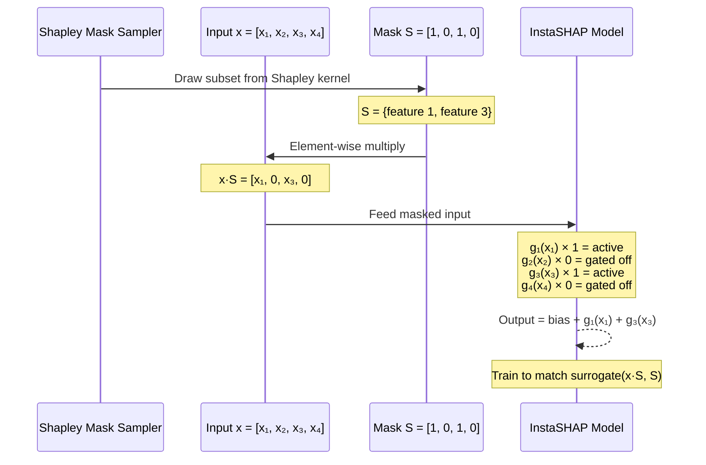

**After training:** Each `gᵢ(xᵢ)` equals the Shapley value `φᵢ(x)` — no separate SHAP computation needed!

### 2.4 Training Flow (What Trains Against What)

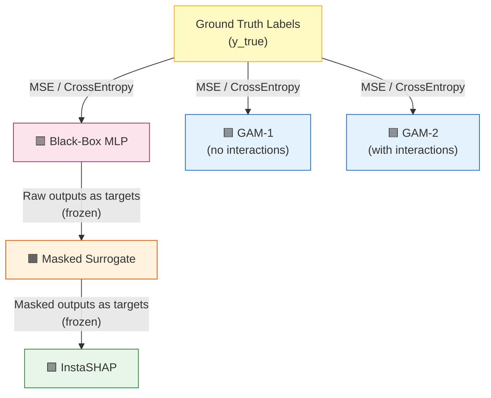

> **Key insight:** InstaSHAP never sees the ground truth labels directly. It learns to replicate the surrogate's behavior under masking, which in turn replicates the black-box's behavior.

---

## 3. Data Flow Architecture

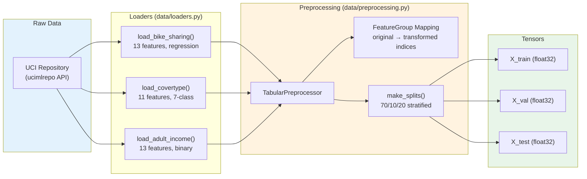

---

## 4. Trade-off Analysis

### 4.1 Speed vs. Fidelity

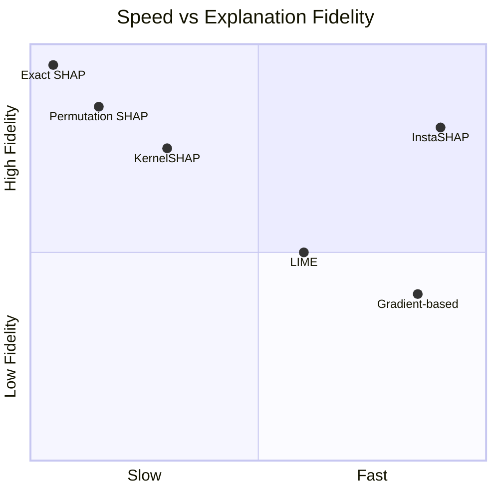

| Method | Speed | Fidelity | Consistency | Amortized Cost |
|--------|-------|----------|-------------|----------------|
| **Exact SHAP** | 🔴 Exponential | 🟢 Perfect | 🟢 Always consistent | None — recomputed every time |
| **Permutation SHAP** | 🔴 ~1000 evals/sample | 🟢 High (stochastic) | 🟡 Approximate | None — recomputed every time |
| **InstaSHAP** | 🟢 1 forward pass | 🟡 Near-perfect | 🟢 Deterministic | 🔴 Upfront training cost |
| **LIME** | 🟡 ~100 evals/sample | 🔴 Low (local linear) | 🔴 Inconsistent across runs | None |
| **Gradient-based** | 🟢 1 backward pass | 🔴 Not Shapley-faithful | 🟡 Model-dependent | None |

### 4.2 Detailed Trade-offs

#### ✅ Advantages of InstaSHAP

| Advantage | Explanation |
|-----------|-------------|
| **Instant explanations** | Single forward pass — enables real-time dashboards, streaming predictions |
| **Deterministic** | Same input always gets the same explanation (no stochastic sampling) |
| **Shapley-faithful** | Satisfies efficiency, symmetry, linearity axioms (unlike LIME, gradients) |
| **Interpretable model** | Each component `gᵢ` is a meaningful shape function you can inspect |
| **Batch-efficient** | Explain thousands of samples in one GPU batch operation |

#### ⚠️ Disadvantages & Costs

| Disadvantage | Explanation |
|--------------|-------------|
| **Upfront training cost** | Must train 3 models (black-box → surrogate → InstaSHAP) before getting any explanations |
| **Surrogate approximation error** | The surrogate may not perfectly replicate `f(x; S)`, introducing cumulative error |
| **Model-specific** | Trained for ONE specific black-box model — if the model changes, retrain everything |
| **Additive constraint** | The InstaSHAP model is additive (even with GAM-2 interactions), limiting representational capacity vs. the black-box |
| **Feature interactions** | Only pairwise interactions are captured; higher-order interactions are approximated |
| **Data-dependent** | Explanation quality depends on training data distribution — may not generalize to out-of-distribution inputs |

### 4.3 When InstaSHAP Wins vs. When It Doesn't

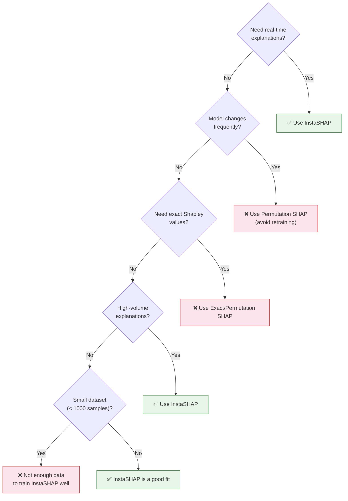

---

## 5. Use Cases

### 5.1 Real-World Application Scenarios

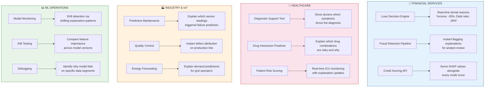

### 5.2 Detailed Use Case Table

| Use Case | Domain | Why InstaSHAP? | Traditional SHAP Problem |
|----------|--------|----------------|--------------------------|
| **Real-time loan decisions** | Finance | Regulators require explanations for every decision; can't wait 10s per application | Permutation SHAP too slow for 10K+ daily applications |
| **Clinical decision support** | Healthcare | Doctors need instant explanations during patient consultations | Can't wait minutes while patient is in consultation |
| **Fraud alert triage** | Finance | Analysts need to see *why* each transaction was flagged, instantly | Thousands of alerts/hour require sub-second explanations |
| **Model monitoring dashboard** | MLOps | Aggregate explanation statistics over millions of predictions | Computing SHAP for millions of records is infeasible |
| **Edge device deployment** | IoT / Mobile | No cloud roundtrip available; explanations must be local | SHAP requires background data and many evaluations |
| **Interactive data exploration** | Research | Users explore "what-if" scenarios and need instant feedback | Each scenario change triggers a new expensive SHAP run |
| **Regulatory compliance** | Finance / Healthcare | GDPR "right to explanation" requires explanations for ALL decisions | Can't retroactively explain millions of historical decisions with SHAP |
| **Autonomous systems** | Robotics / AV | Real-time decision justification for safety-critical systems | Latency constraints prohibit iterative SHAP |

### 5.3 This Project's Specific Use Cases (Datasets)

| Dataset | Real-World Scenario | Explanation Value |
|---------|---------------------|-------------------|
| **Bike Sharing** | City transport planning — predict hourly demand | Understand that `hour × workingday` interaction drives commute vs. leisure patterns. Planners can optimize bike station placement. |
| **Covertype** | Forest service resource allocation — classify vegetation | Understand that `elevation` is the dominant predictor. Rangers can focus surveys on elevation bands rather than costly soil analysis. |
| **Adult Income** | Social policy — predict income brackets | Identify which demographic factors most influence income predictions. Flag potential bias in `race` or `sex` attributions. |

---

## 6. Comparison with Alternative Approaches

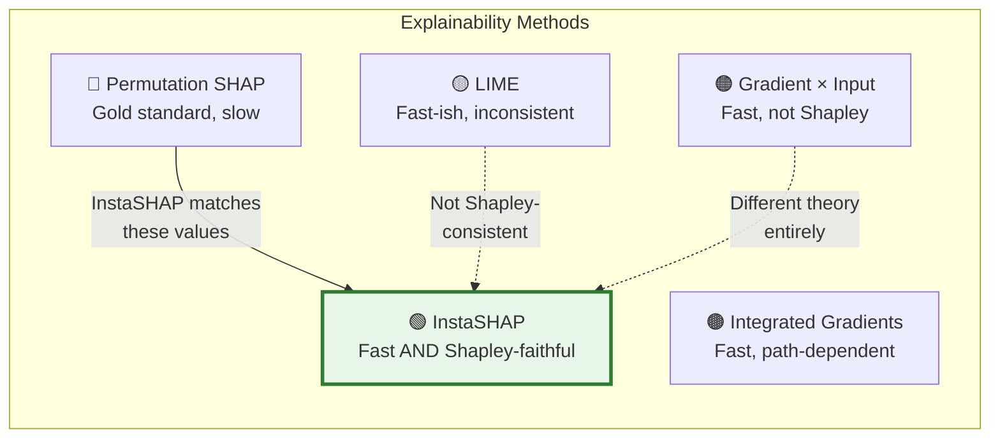

| Criterion | Permutation SHAP | LIME | Gradient-Based | InstaSHAP |
|-----------|-----------------|------|----------------|-----------|
| **Theoretical basis** | Shapley values | Local linear model | Backpropagation | Shapley values (via additive model) |
| **Speed** | O(2ⁿ) approximate | O(100) perturbations | O(1) backward pass | O(1) forward pass |
| **Determinism** | ❌ Stochastic | ❌ Stochastic | ✅ Deterministic | ✅ Deterministic |
| **Model-agnostic** | ✅ Any model | ✅ Any model | ❌ Differentiable only | ❌ Needs training pipeline |
| **Efficiency axiom** | ✅ Attributions sum to prediction | ❌ No guarantee | ❌ No guarantee | ✅ By construction |
| **Setup cost** | None | None | None | High (3 models to train) |
| **Works for new data** | ✅ | ✅ | ✅ | ✅ (within distribution) |

---

## 7. Performance Architecture

### 7.1 Computational Cost Breakdown

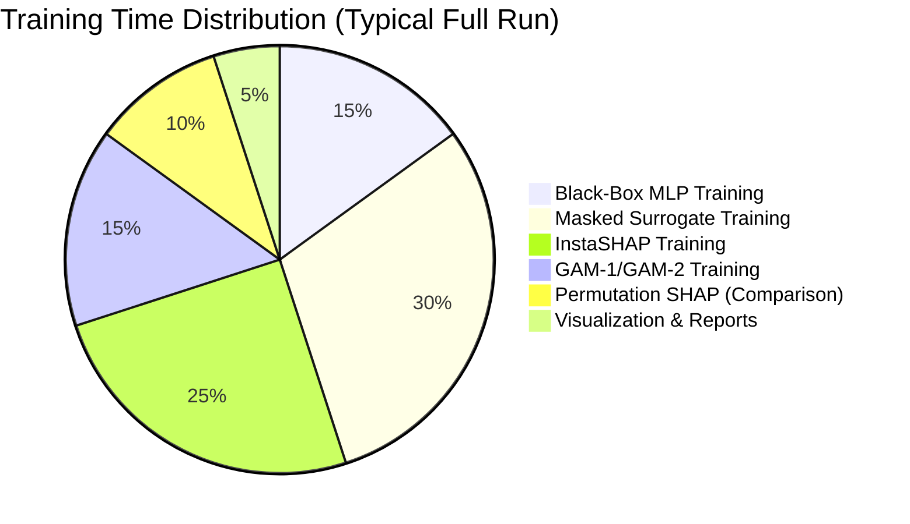

### 7.2 Inference Speed Comparison

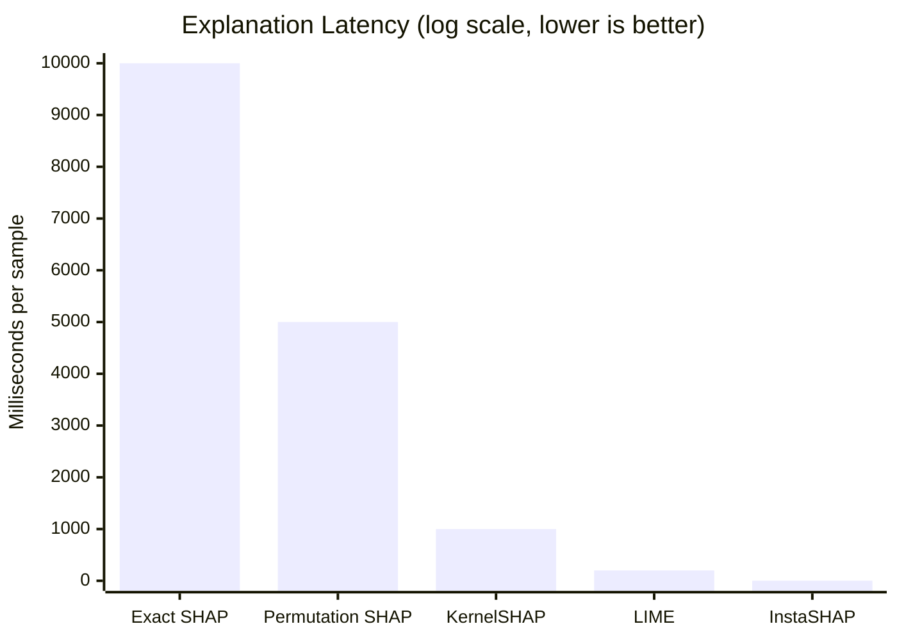

---

## 8. Key Architectural Decisions & Rationale

| Decision | Rationale | Alternative Considered |
|----------|-----------|----------------------|
| **Additive architecture (GAM)** | Shapley values emerge naturally from additive components under the masked objective | Full MLP — but wouldn't decompose into per-feature attributions |
| **Two-stage distillation (BB → Surrogate → InstaSHAP)** | Surrogate amortizes the cost of masked evaluations; InstaSHAP then learns from surrogate | Direct InstaSHAP training against black-box — too expensive (exponential masked evals) |
| **Shapley kernel sampling** | Matches the theoretical weighting of the Shapley formula; proven to converge | Uniform mask sampling — biased, doesn't match Shapley weights |
| **Edge mask probability (10%)** | Adding all-zero and all-one masks stabilizes training at the boundaries | No edge masks — training can be unstable for extreme subsets |
| **AdamW optimizer** | Better generalization through decoupled weight decay | Adam, SGD — AdamW is standard for modern neural networks |
| **Early stopping on validation loss** | Prevents overfitting; restores best checkpoint | Fixed epochs — risk of over/under-training |
| **Feature group bookkeeping** | One-hot columns must be aggregated back to original features for meaningful explanations | Treating each one-hot column as a separate feature — unintelligible explanations |

---

## 9. Summary: The InstaSHAP Value Proposition

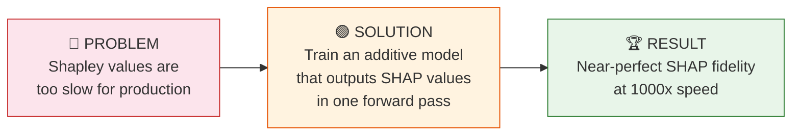

> **Bottom line:** InstaSHAP trades upfront training cost for near-instant, Shapley-faithful explanations at inference time — making real-time explainable AI practical for the first time.

---

*This architecture document complements the [main research report](InstaSHAP_Research_Project_Report.md) with visual diagrams, trade-off analysis, and practical use-case guidance.*
