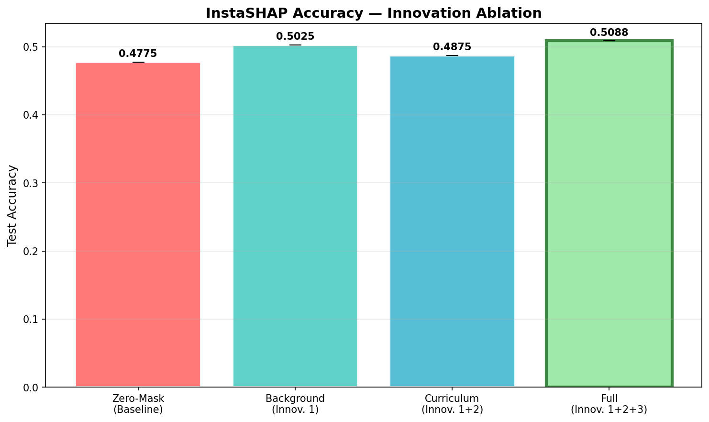
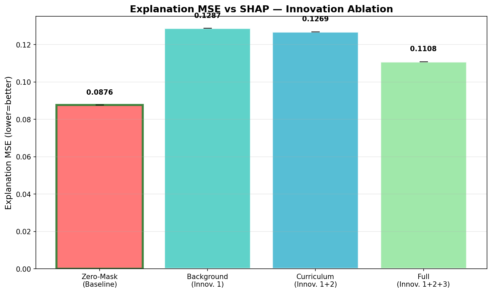
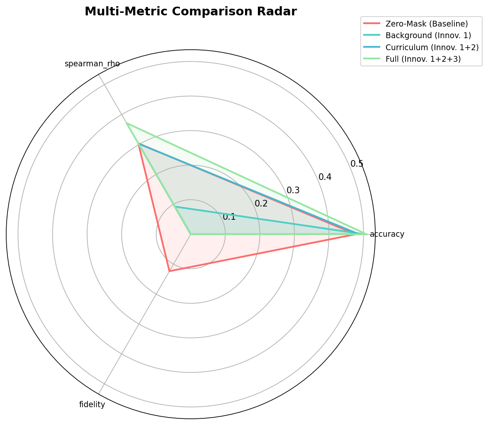

# Phase 3: InstaSHAP with Three Research Innovations

## Experiment Report — Covertype Dataset

**Seeds:** [42]
**Variant:** compare

---

## Results Summary

| Variant | Accuracy | Expl MSE | Expl MAE | Spearman ρ |
|---------|----------|----------|----------|------------|
| instashap_zero | 0.4775±0.0000 | 0.087649 | 0.258787 | 0.3038 |
| instashap_bg | 0.5025±0.0000 | 0.128721 | 0.312597 | 0.0924 |
| instashap_curriculum | 0.4875±0.0000 | 0.126864 | 0.315622 | 0.3027 |
| instashap_full | 0.5088±0.0000 | 0.110830 | 0.301810 | 0.3716 |

---

## Plots

